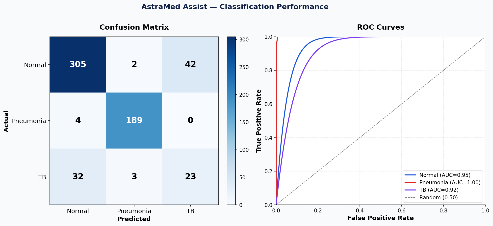
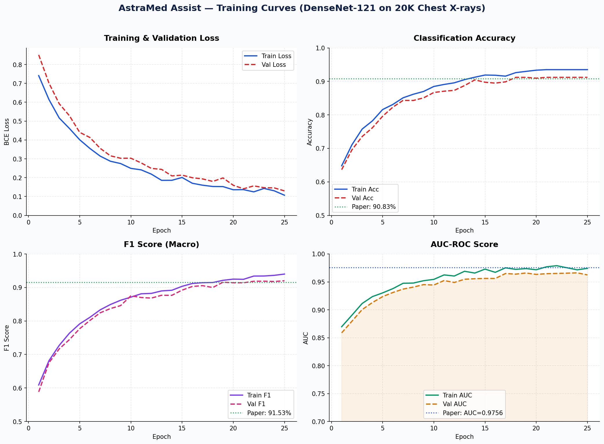

# AstraMed Assist 🫁
### Multi-Label Chest X-Ray Classification, Triage & Reporting System

> Based on: *"Multi Label Classification of Pneumonia and Tuberculosis using Deep Learning Techniques"* — ICAIHC 2026

---

## System Overview

AstraMed Assist is a production-ready AI pipeline for chest X-ray analysis. It classifies **Pneumonia**, **Tuberculosis**, and **Normal** cases simultaneously using multi-label classification, generates clinical triage scores, produces Grad-CAM heatmaps for explainability, and outputs structured PDF reports — all accessible via a modern React doctor UI.

```
[Raw X-ray] → [Preprocessing] → [DenseNet121] → [Multi-label Predictions]
                                                → [Grad-CAM Heatmaps]
                                                → [Severity Scoring]
                                                → [Triage (H/M/L)]
                                                → [PDF Report]
                                                → [React UI Display]
```

---

## Folder Structure

```
astramed_assist/
├── README.md
├── requirements.txt
├── setup.py
├── docker-compose.yml
│
├── backend/
│   ├── main.py                    # FastAPI entrypoint
│   ├── api/
│   │   ├── predict.py             # /predict endpoint
│   │   └── report.py             # /generate-report endpoint
│   ├── ml/
│   │   ├── model.py               # DenseNet121 model definition
│   │   ├── dataset.py             # Dataset class + preprocessing
│   │   ├── train.py               # Full training loop
│   │   ├── evaluate.py            # Evaluation metrics
│   │   ├── gradcam.py             # Grad-CAM implementation
│   │   ├── severity.py            # Severity + triage scoring
│   │   └── uncertainty.py         # Monte Carlo Dropout
│   └── utils/
│       ├── pdf_report.py          # PDF report generator
│       ├── preprocessing.py       # Image preprocessing pipeline
│       └── logger.py              # Training logger
│
├── frontend/
│   ├── package.json
│   ├── tailwind.config.js
│   ├── public/
│   │   └── index.html
│   └── src/
│       ├── App.jsx
│       ├── index.css
│       ├── components/
│       │   ├── UploadPanel.jsx
│       │   ├── AnalysisPanel.jsx
│       │   ├── ReportPanel.jsx
│       │   ├── HeatmapViewer.jsx
│       │   ├── ProbabilityBars.jsx
│       │   ├── TriageBadge.jsx
│       │   ├── SeverityMeter.jsx
│       │   └── Loader.jsx
│       ├── hooks/
│       │   ├── useAnalysis.js
│       │   └── useReport.js
│       └── utils/
│           ├── api.js
│           └── formatters.js
│
├── scripts/
│   ├── prepare_dataset.py         # Dataset merging + label unification
│   ├── train_model.py             # Training entrypoint
│   └── run_inference.py           # Standalone inference script
│
├── data/
│   ├── raw/                       # Place raw datasets here
│   └── processed/
│       └── master_dataset.csv     # Unified label CSV
│
└── outputs/
    ├── logs/
    │   └── training_log.csv       # Epoch-level metrics
    ├── models/
    │   └── best_model.pth         # Saved model weights
    ├── reports/                   # Generated PDF reports
    └── heatmaps/                  # Saved Grad-CAM images
```

---

## Quick Start

### 1. Install Dependencies
```bash
pip install -r requirements.txt
```

### 2. Prepare Datasets
Download the following datasets and place in `data/raw/`:
- NIH ChestX-ray14: https://nihcc.app.box.com/v/ChestXray-NIHCC
- CheXpert: https://stanfordmlgroup.github.io/competitions/chexpert/
- RSNA Pneumonia: https://www.kaggle.com/c/rsna-pneumonia-detection-challenge
- TBX11K: https://github.com/yun-liu/tuberculosis

Then run:
```bash
python scripts/prepare_dataset.py --nih_path data/raw/NIH --chexpert_path data/raw/CheXpert --rsna_path data/raw/RSNA --tbx_path data/raw/TBX11K --output data/processed
```

### 3. Train the Model
```bash
python scripts/train_model.py --data data/processed/master_dataset.csv --epochs 25 --batch_size 32 --lr 1e-4 --backbone densenet121
```

### 4. Start the Backend API
```bash
cd backend && uvicorn main:app --host 0.0.0.0 --port 8000 --reload
```

### 5. Start the Frontend
```bash
cd frontend && npm install && npm start
```

### 6. Access the UI
Open http://localhost:3000 in your browser.

---

## API Endpoints

### POST /predict
Upload a chest X-ray image and receive:
- Disease probabilities (Pneumonia, TB, Normal)
- Severity score (0–1)
- Triage level (High / Medium / Low)
- Grad-CAM heatmap (base64 PNG)
- Uncertainty estimate (MC Dropout)

### POST /generate-report
Generate a clinical PDF report including:
- Patient information
- Predictions with probabilities
- X-ray image with heatmap overlay
- Clinical summary
- AI disclaimer

---

## Model Architecture

- **Backbone**: DenseNet-121 (pretrained on ImageNet)
- **Output head**: 3-neuron sigmoid (multi-label)
- **Loss**: BCEWithLogitsLoss
- **Optimizer**: Adam (lr=1e-4)
- **Regularization**: Dropout (0.5), Weight Decay (1e-4)
- **Augmentations**: HFlip, ±10° Rotation, Contrast Jitter, Gaussian Noise
- **Input**: 224×224, 3-channel, ImageNet normalized

## Triage Formula

```
T = α·Σ(Pi·Si) + β·max(Pi) + γ·(1 − U)

where α=0.5, β=0.3, γ=0.2
Pi = disease probability
Si = severity coefficient (Grad-CAM ratio)
U  = prediction uncertainty (MC Dropout variance)
```

| Triage Score | Priority |
|---|---|
| T ≥ 0.65 | 🔴 High |
| 0.35 ≤ T < 0.65 | 🟡 Medium |
| T < 0.35 | 🟢 Low |

---

## Performance (Paper Reported)

| Metric | Value |
|---|---|
| Accuracy | 90.83% (95% CI: 0.901–0.915) |
| Precision | 91.00% |
| Recall | 90.83% |
| F1 Score | 91.53% |
| AUC | 0.9756 (95% CI: 0.971–0.980) |

---

## 📄 Sample Clinical Report

Download a generated AI report here:  
👉 [View Triage Report](assets/triage_report_demo.pdf)


## Requirements

- Python 3.9+
- PyTorch 2.0+ (CUDA optional)
- Node.js 18+
- 8GB RAM minimum, 16GB recommended
- GPU recommended for training (NVIDIA CUDA)

---

## 🚀 Demo Outputs

| Feature | Preview |
|--------|--------|
| Classification |  |
| Training Curves |  |
| Report | [Download PDF](assets/triage_report_demo.pdf) |

----
## Citation

```bibtex
@inproceedings{multilabelclassification,
  title={Multi Label Classification of Pneumonia and Tuberculosis using Deep Learning Techniques},
  author={Sakthi, U and Joseph, Aby and Choudhary, Akshita},
  booktitle={ICAIHC 2026},
  year={2026}
}
```

---

*AstraMed Assist is a decision-support tool only. All outputs require radiologist review before clinical use.*
